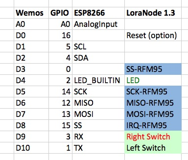
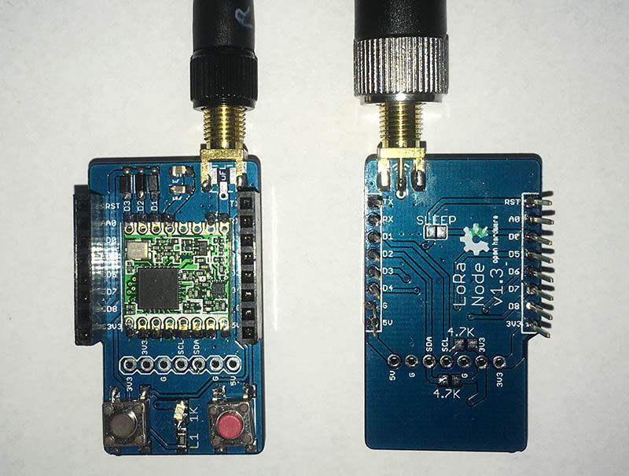
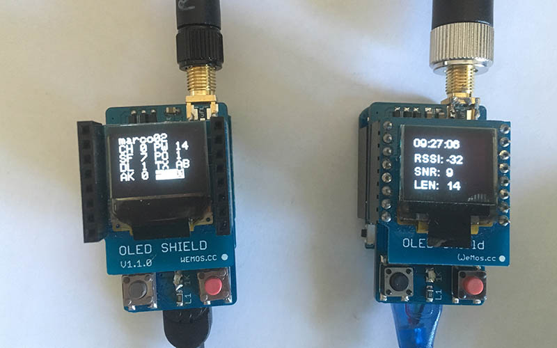

# LoRa Node 1.3
PCB design by Mauro Alfieri and Marco Brianza

A LoRa shield for [WeMos](https://www.wemos.cc/) D1 mini boards  
Made to experiment a LoRaWan radio node and single channel gateway.
based on the projects:  

* WeMos-Lora [https://github.com/hallard/WeMos-Lora](https://github.com/hallard/WeMos-Lora)
* Wemos shield template [https://github.com/SuperHouse/D1MSHO](https://github.com/SuperHouse/D1MSHO)

PCB tested ready for manufactoring:  

* PCBWay [https://www.pcbway.com/project/shareproject/LoRa_Node_1_3.html](https://www.pcbway.com/project/shareproject/LoRa_Node_1_3.html)  
* PCBs.io [https://PCBs.io/share/4XRGg](https://PCBs.io/share/4XRGg) 

The reference BOM:  
[http://www.tme.eu/parking/d9c2f42be567335629e84ae2b3406e02d69110b7.html
](http://www.tme.eu/parking/d9c2f42be567335629e84ae2b3406e02d69110b7.html)

To use the board as node use this version of the lmic LoRa library:  
[https://github.com/marcobrianza/arduino-lmic](https://github.com/marcobrianza/arduino-lmic)  
It supports the LoraNode 1.3 pinout and fixes the radio power setting

Some practial examples with wrapping of the LMIC in more Arduinistic way are here:
[https://github.com/marcobrianza/LoraNode_Examples](https://github.com/marcobrianza/LoraNode_Examples)

To use it as gateway this repo:  
[https://[github.com/marcobrianza/ESP-1ch-Gateway-v4.0/tree/LoraNode_1.3](github.com/marcobrianza/ESP-1ch-Gateway-v4.0/tree/LoraNode_1.3) 

## Usage Notes
The pinout is as the following table  

* I2C pins are free to be used for sensors or GPIO (pull up resistor are optional on the bottom) 
* D0 is free and can be connected to Reset with the "sleep" pad on the bottom of the board 
* The 2 switches (normally opened) are shared with the serial port pins
* The LED is connecred in parallel with the Built in LED of Wemos 

## Pictures

The board assembled top and bottom

The board in use as node and gateway with wemos oled display

